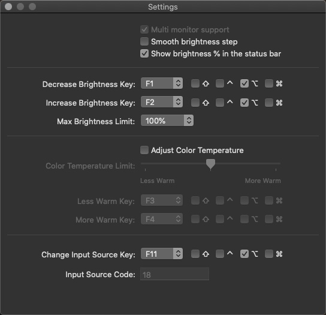
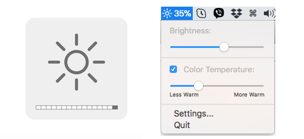
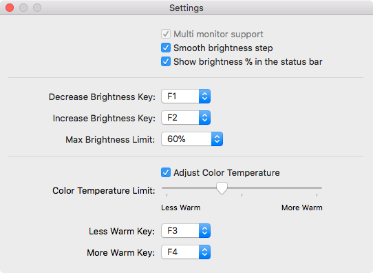
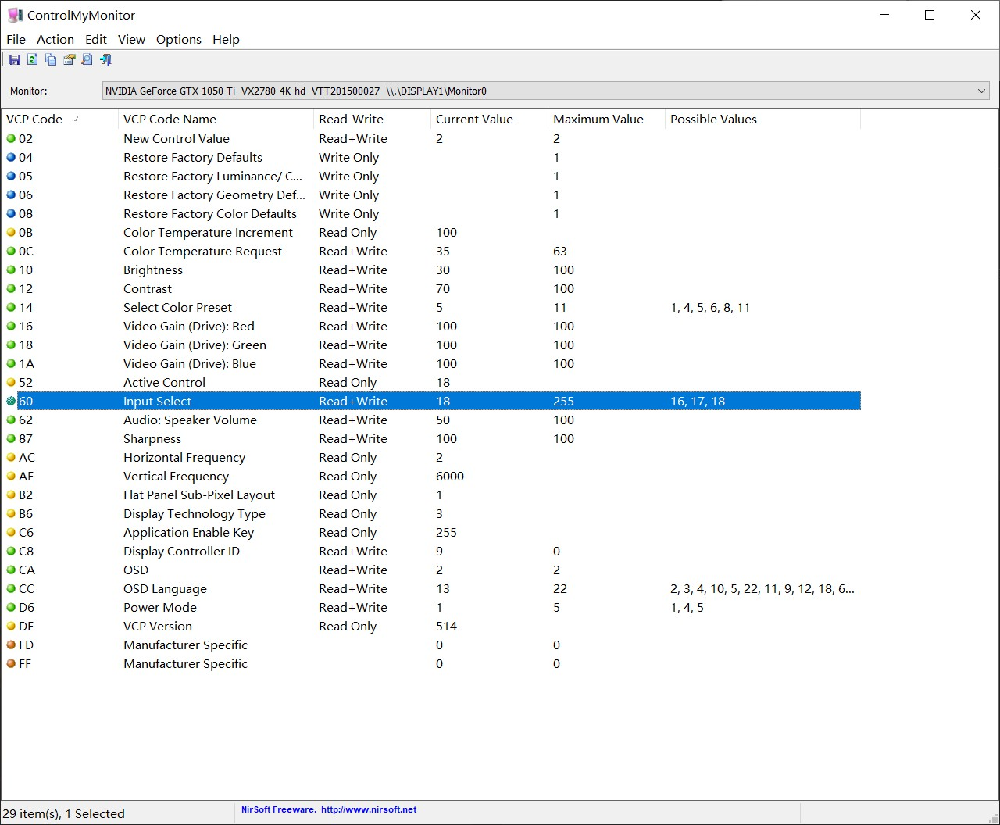
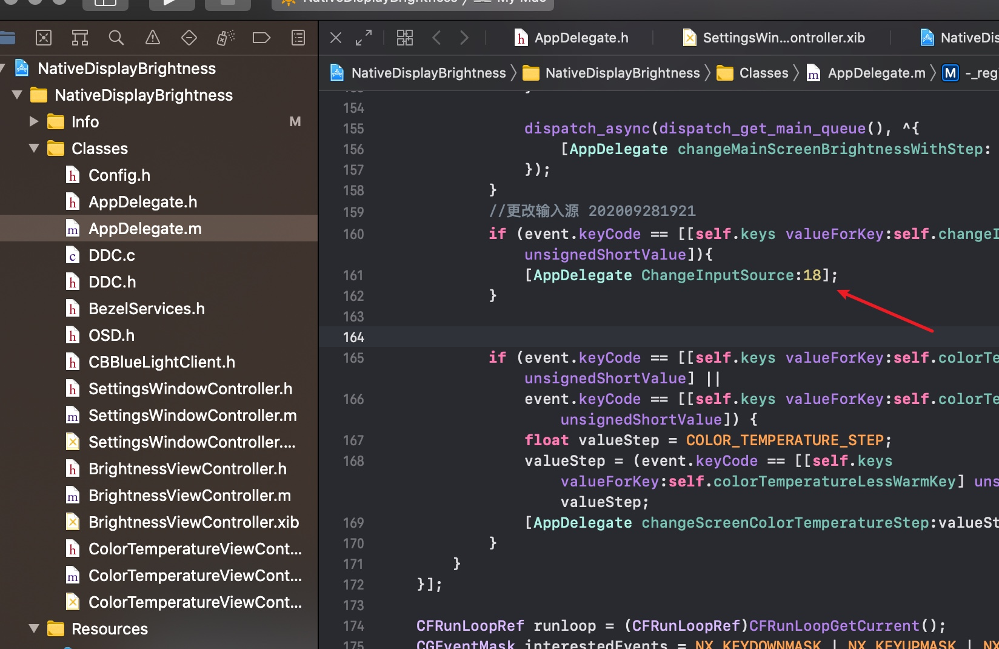

# NativeDisplayBrightnessPlus

*2012款MACBOOK PRO使用EGPU外置显卡教程:*  [http://1vr.cn/?p=2239](http://1vr.cn/?p=2239)

202111221040更新:
1,热键可使用组合键.
2,输入源代码可在设置中直接输入.
感谢Etheo-W的修改.

*使用热键控制外屏显示器的亮度,色温,输入源等*

##使用方法
需要用Xcode编译该工程为你的电脑所用.

用`F1` /  `F2`能改变外屏的亮度
用 `F12`  可以更改显示器的输入源

快捷键可以从`F1`-`F20`中设定

更改亮度时使用了原生系统亮度调整的UI,所以它使用了私有的`BezelServices`框架.

## 输入源的设定

使用ControlMyMonitor软件([http://www.nirsoft.net/utils/control_my_monitor.html](http://www.nirsoft.net/utils/control_my_monitor.html)),这个软件是绿色的免费的.但需要在Windows下运行,下载后直接运行可以看到显示器可控的方法和值,注意高亮部分:

`Input Select`为输入源,其中`Current Value`为当前输入口的值,在`Possible Values`查看可用的值,我这台显示器有2个hdmi,1个dp,一共三个输入口.所以有16,17,18三个值.PC主机接在了hdmi口,即这里的18,Macbook的eGPU接在了dp口,即16,那么我们想从Mac中一键切至PC为输入源显示在外屏中,那么就修改Xcode项目中对应的值为18,项目中的`AppDelegate.m`文件的 161 行数值,编译后放入Application目录下即可使用:

## 显示器兼容性

显示器需要支持DDC/CI才能使用该工具控制.

## 支持多显示器

如果有多台外接显示器,软件将控制当前激活的显示器.

## 系统版本需求

macOS: 10.12.4以后

## License
基于 [https://github.com/KAMIKAZEUA/NativeDisplayBrightness](https://github.com/KAMIKAZEUA/NativeDisplayBrightness)的项目增加了输入源控制功能.

借鉴使用了[ddcctl](https://github.com/kfix/ddcctl) 及 [DDC-CI-Tools](https://github.com/jontaylor/DDC-CI-Tools-for-OS-X)的代码.
